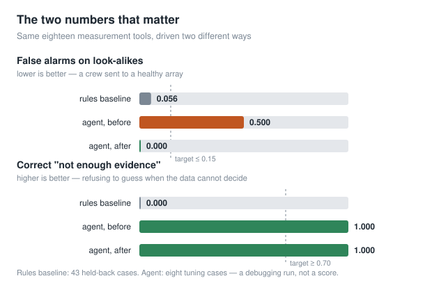
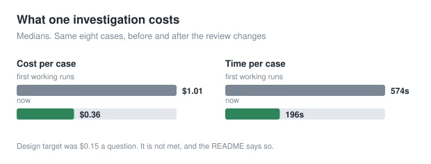
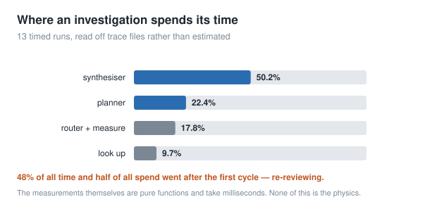
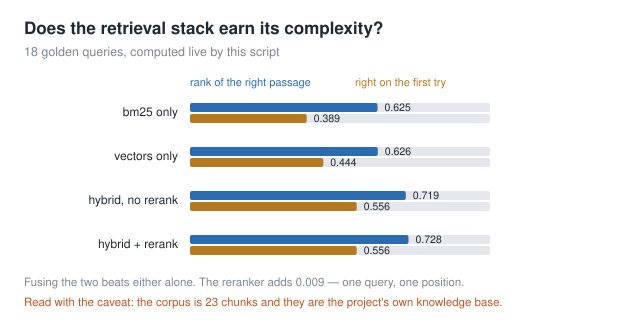

# Solar Plant Root-Cause Diagnosis with an Evidence-Constrained Agent

An agent that investigates why a photovoltaic plant is underperforming and says
which of eight causes it is — or refuses to guess and names the test that would
settle it. Eighteen atomic measurement tools, physics-level fault injection onto
real NREL data, a hand-written rules baseline through the same tools, and an
evaluation that can fail.

The output is one of three instructions: **send someone, schedule something, or
do nothing.** The third is the one nobody sells and often the most valuable.

> **Status: all 13 steps built. The agent has been run, and it has not been
> scored.** Those are different claims. Eight tuning cases have been run end to
> end, and they are the eight cases the tools were tuned against, so the number
> is optimistic by construction. See [Results](#results) for the figures and the
> three reasons not to quote them.
>
> New here? **[`docs/WALKTHROUGH.md`](docs/WALKTHROUGH.md)** explains the whole
> project end to end.

---

## The problem

A plant produces less than it should. Someone has to say why, and the answer
decides whether a truck rolls. The hard part is not spotting the deficit — it is
that the benign explanations look identical to the expensive ones on the only
signal most monitoring looks at:

| What you see | Could be | Costs |
| --- | --- | --- |
| output down 12% this month | a failed string | an electrician, same day |
| output down 12% this month | dust on the glass | a wash, scheduled |
| output down 12% this month | it was cloudy, or it was hot | nothing |
| output flat at midday | inverter clipping, by design | nothing |
| output flat at midday | the grid operator curtailing you | a phone call |
| performance ratio falling | the array degrading | investigation |
| performance ratio falling | the irradiance sensor drifting | clean one sensor |

Three of those are faults and five are not, and **a crew dispatched to a healthy
array is the failure that happens most often.** So the task is differential
diagnosis, not detection: hold several causes at once, choose the measurement
that separates them, and commit only when one survives.

---

## What's in the system

| Component | What it does | Method |
| --- | --- | --- |
| **Measurement tools** | 18 atomic analyses — performance ratio, onset sharpness, per-string balance, clear-sky consistency | Pure deterministic functions, Pydantic-validated, no tool returns a fault class |
| **Agent loop** | Plans candidate causes, picks measurements, writes a finding or an honest refusal | 4 LLM nodes (planner / router / synthesiser / critic) + a non-LLM executor |
| **Review** | Blocks fabricated figures, unweighed look-alikes, and abstentions the agent could have resolved itself | Deterministic checks, with the LLM reviewer optional and measured |
| **Fault injector** | Ground truth for 86 evaluation cases | Physics-level injection onto **real measured** series — never "reduce PR by 0.12" |
| **Rules baseline** | The thing the agent must beat | Hand-written rules through the **same 18 tools**, so a gap is reasoning, not measurement |
| **Evaluation** | Scores both engines, reports what a subset cannot support | 86 cases, tuning / held-back split, macro-F1 with abstention as its own class |
| **Watcher** | Decides which questions are worth asking | Replay clock, deficit sweep, findings ranked by energy at stake |
| **Dashboard** | Plant data, findings queue, and a full replay of any investigation | FastAPI + Alpine.js + Plotly, calls `src/` and computes nothing itself |
| **Retrieval** | Background evidence on candidate causes | BM25 + character n-gram TF-IDF + reciprocal rank fusion + lexical reranker |

---

## Results

### The two numbers that matter



**False alarms on look-alikes** is the headline, not overall accuracy. A
detector that alarms on any deficit scores well on clean faults and is useless
in the field; only the look-alike column exposes that.

**Correct "not enough evidence"** is where the baseline cannot compete at all.
The rules engine scores 0.000 structurally — it commits to the first rule that
fires and cannot represent "two causes survive and here is the test that
separates them", so on all five unresolvable cases per split it confidently
answers "clipping".

| | Rules baseline (43 held-back) | Agent (8 tuning cases) |
| --- | --- | --- |
| Overall accuracy | 0.469 | 0.700 |
| Cause accuracy | — | 0.875 |
| **False alarms on look-alikes** | 0.056 | **0.000** |
| **Correct "not enough evidence"** | **0.000** | **1.000** |
| Missed real faults | 0.438 | 0.000 |

**Three reasons the agent column is not a score.** Eight cases is a subset, and
the harness prints so above every run. The tools were changed *in response to
these eight failing*, which is tuning — the other 35 tuning cases are the fairer
test and the held-back split is the real one. And only one of the two
improvements is attributable: one case read the corrected string figure and
moved off `string_outage`, which is the predicted mechanism, while the other
took a different measurement path and may simply have varied. LLM nodes are not
deterministic and one run per case cannot separate a fix from a coin.

### What one investigation costs



### Where the time goes



Measured from trace files already on disk rather than estimated — `python -m
eval.runner profile` reads them. The finding that mattered: **48% of all time
and half of all spend went after the first cycle**, re-reviewing answers that
four cases had already got right. That is what made the review loop a latency
problem and an accuracy problem at once.

### Does the retrieval stack earn its complexity?



Fusing sparse and dense beats either alone by about 0.09 of reciprocal rank. The
reranker adds 0.009 — one query moving one position — so on this evidence it is
close to cost without benefit. **Read it with the caveat in the chart**: the
corpus is 23 chunks and they are the project's own knowledge base, so this
measures finding the right entry among 23 items that could equally be fetched by
key.

> Every figure here is generated by `scripts/make_charts.py` from
> [`docs/results.json`](docs/results.json), which names the source of each
> measurement. The retrieval chart is computed live from the committed corpus.

---

## How an investigation runs

```
question + window
      │
      ▼
   PLANNER ──── candidate causes, what each costs to act on,
   (LLM)        which tool separates which pair
      │
      ▼
   RETRIEVE ─── what is known about these causes        (no LLM)
      │
      ▼
   ROUTER ───── one call: next measurement, or stop  ◄──┐
   (LLM)        may depart from plan, must say why      │
      │                                                 │
      ▼                                                 │
   EXECUTOR ─── run the tool, record provenance  ───────┘
   (no LLM)
      │
      ▼
   SYNTHESISER  the finding, or an honest refusal
   (LLM)        every figure must trace to a measurement
      │
      ▼
   REVIEW ───── accept / send back / not enough evidence
      │         deterministic checks + optional LLM judgement
      └──────── send_back ──► back to PLANNER
```

Five guarantees are enforced by arithmetic, not by asking a model to check its
own work:

1. **Every figure traces to a measurement.** Numeric literals in the answer are
   matched against the union of the tool results' provenance ledgers. Quotation
   from what the agent was *shown* is allowed; arithmetic on measured values is
   not, because the subtraction belongs in a tool where it is testable.
2. **Every look-alike is weighed by measurement.** Seven of them, on every
   investigation, and "weighed" means a tool that discriminates it actually ran.
3. **An unsettled answer may never show a cause or a confidence.** That is the
   exact bug that dispatches a wash crew to a clean array.
4. **An abstention may not name a measurement the agent could have taken.**
   "Run `string_onset_scan`" is an unfinished investigation; "pull the grid
   operator's dispatch log" is an honest refusal. A registry lookup tells them
   apart.
5. **Agency is measured, never asserted.** Every call records `was_planned`,
   derived by the executor rather than self-reported.

---

## Three things I learned

**A green test suite says the code on that disk works, not that the repository
does.** Thirteen build steps produced ~900 passing tests while the LLM path had
never executed once. Every failure in the first real runs was a first-execution
failure: a pinned SDK that predated the API being used, schema constraints the
structured-output endpoint rejects, a token ceiling that bounds thinking and
reply together. None of it was reachable without a key, and none of it was
caught by tests that stubbed the boundary.

**The evaluation harness is not only for producing scores.** Half the real bugs
were invisible until something was built to *look* at data already recorded — a
provenance ledger that overwrote itself on repeated tool calls, traces
concatenating across runs, a fall printed as a rise with a test that agreed with
the bug. `profile` and `explain` both exist because a number was wrong and
nothing could say why.

**A reviewer with no memory always finds something.** The critic's prompt held
the evidence and the draft and *nothing about its own previous review*, while the
planner and synthesiser both received its revision request. Information flowed
one way. Four cases reached the right cause and were talked out of it, because
`send_back` was the equilibrium rather than an accident.

---

## Limitations

- **The agent is not scored.** Eight tuning cases, tuned against. The full tuning
  split then the held-back split is what turns the v1 targets into a verdict.
- **RAG is built and not in the loop.** `investigate` defaults to the
  hand-written knowledge base — a dictionary lookup on cause names — so every
  "looked up what is known about…" line in every run log is that lookup.
  `CorpusRetriever` is tested, measurably better than BM25 alone, and constructed
  by nothing. The corpus is 23 chunks and *is* the knowledge base.
- **Whether the reasoning is sound is open.** One case stated the right
  discriminator unprompted — *"a string outage shows exactly one step"* —
  measured it three times, got three answers pointing at soiling, and cited none
  of them. Correcting tools raises the floor; it does not show the reasoning
  above it is reliable.
- **Cost and latency miss the design target.** $0.36 and ~3 minutes a case
  against a target of $0.15. The synthesiser alone is half of all latency.
- **One plant, two years.** Generalisation across sites is untested.

---

## Architecture

```
src/            UI-agnostic core — everything the agent and dashboard share
  clock.py        the ONLY time source (no datetime.now() in src/, enforced)
  trace/          TraceStep model + JSONL writer — the dashboard's data source
  agent/          state, nodes, plain loop, LangGraph port, grounding checks
  physics/        performance ratio, expectation model, cell temperature
  tools/          the 18 measurements + registry
  knowledge/      hand-written fault signatures (YAML) + cause vocabulary
  rag/            corpus, hybrid index, retriever
  baseline/       the rules engine
  detect/         the Watcher's deficit sweep
simulator/      physics-level fault injectors
eval/           runner, metrics, agency metrics, golden sets, profile, subset
dashboard/      FastAPI + Jinja2 + Alpine.js; thin, calls src/ only
watcher.py      CLI: advance the clock, sweep, write findings
scripts/        chart generation for this README
```

Python 3.11, uv with a committed lockfile, Pydantic v2 at every boundary, ruff +
mypy, **906 tests**. The loop is written twice — plain Python and a LangGraph
state machine — with eighteen exact-equality tests asserting they agree. The
plain loop is the specification; the graph is what runs.
[`docs/LANGGRAPH_TRADEOFF.md`](docs/LANGGRAPH_TRADEOFF.md) records what the
framework bought, including a correction to its own headline claim.

---

## Reproduce it

```bash
uv sync --extra dev          # --extra dev brings pytest, ruff and mypy
uv run pytest                # 906 tests, no API key needed
```

**Everything here runs without a key:**

```bash
uv run python -m src.data.cli ingest --system 4902 --years 2016 2017
uv run python -m eval.runner build                 # 86 golden cases
uv run python -m eval.runner run --engine rules --split both
uv run python -m eval.runner retrieval             # the retrieval ablation
uv run python watcher.py run --until 2016-09-01 --step 14D --engine rules
uv run uvicorn dashboard.app:app --reload          # http://127.0.0.1:8000
uv run python scripts/make_charts.py               # the figures above
```

**These read runs already on disk** — where most of the debugging happens:

```bash
uv run python -m eval.runner profile               # seconds and $ per node
uv run python -m eval.runner explain G-004         # one case's whole reasoning
```

**These need a key** (`cp .env.example .env`):

```bash
uv run python -m eval.runner run --engine agent --split tuning --checks-only \
    --resume runs/tuning.jsonl --out runs/tuning.json
uv run python -m eval.runner compare --split heldback
uv run python -m eval.runner experiments --runs 3  # ablations, mean ± spread
```

Review has three modes: the default (checks + LLM reviewer), `--checks-only`
(the deterministic half, which is what the evidence points at shipping), and
`--no-review` (nothing — the ablation's control). `--resume FILE` records each
case as it finishes, so an API overload at case 20 costs one case rather than
the run.

**Iterating?** `--sample 8` draws a stratified subset that keeps look-alikes and
unresolvable cases in proportion. Any subset prints, above the results, which
metrics it cannot support.

---

## Data

Public data only. **NREL PVDAQ system 4902, NIST_Ground_1** (Gaithersburg MD) —
270.7 kW, 1152 modules on a fixed 20° due-south mount, 2016–2017 at 15-minute
resolution. It carries **7 per-combiner DC current channels**, which is unusual
and load bearing: the per-string comparisons run on real measurements rather
than simulation.

Datasets are never committed. The ingest downloads into a gitignored `data/raw/`
and writes a manifest with a SHA-256 per source file, so the dataset is
reproducible without shipping it.

**No fault logs exist** anywhere in the PVDAQ archive, so ground truth comes
from physics-level injection onto the measured series — which is exactly why
injecting at the physics layer rather than the signature layer matters. Three
things the ingest does that are easy to get wrong:

- **Channel resolution is by physical plausibility, not name.** This system
  exposes three POA channels and only one reads in W/m²; the others are ~115×
  smaller. Picking on name alone makes every performance ratio wrong by that
  factor while still looking plausible.
- **The logger's timezone is recovered, not assumed.** Every half-hour offset is
  scored against a modelled clear-sky curve. NIST 4902 came back UTC−5 at
  r = 0.997 — Eastern *Standard* Time year round, no daylight saving.
- **The simulator and the expectation model share no configuration.** Simulate
  with the detailed stack, form expectations with the coarser one. Otherwise
  every injected deficit is trivially detectable and accuracy is meaningless.

---

## Documentation

| Document | What it is for |
| --- | --- |
| [`docs/WALKTHROUGH.md`](docs/WALKTHROUGH.md) | The whole project end to end — start here |
| [`docs/FINDINGS.md`](docs/FINDINGS.md) | What the evaluation measured, including the bugs it found in *itself* |
| [`docs/DECISION.md`](docs/DECISION.md) | Append-only log of every non-obvious choice, with alternatives |
| [`docs/LANGGRAPH_TRADEOFF.md`](docs/LANGGRAPH_TRADEOFF.md) | Plain loop vs framework, honestly |
| [`CLAUDE.md`](CLAUDE.md) | The engineering rules that stop the project quietly cheating |

The section of `FINDINGS.md` worth reading first is **"Bugs the evaluation found
in itself"** — an injector that left string currents untouched while claiming a
string fault, a case designed to be unresolvable that was quietly resolvable, a
tool measuring against a theoretical reference and reporting a permanent plant
characteristic as a deficit. Each would have made a published accuracy figure
meaningless.

---

## Background reading

- Performance ratio and temperature correction: IEC 61724-1, and the Faiman cell
  temperature model used here for the correction.
- PVWatts and the loss model behind `compute_expected_output`: NREL PVWatts
  technical reference.
- The dataset: NREL PVDAQ, system 4902 (NIST Gaithersburg).

---

## Licence

Code under MIT. The underlying PVDAQ data is public domain and is not
redistributed here — the ingest fetches it and commits only checksums.
